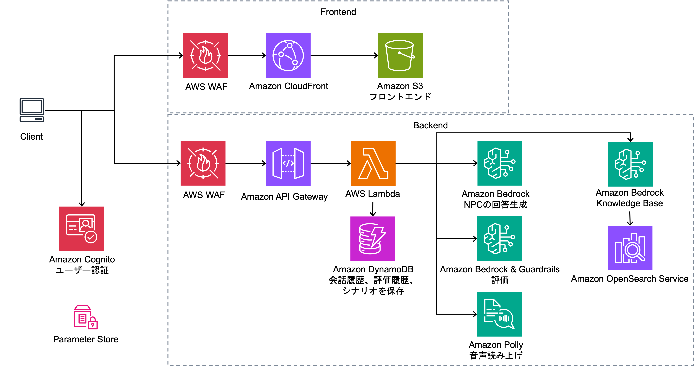

# AI営業ロールプレイ

## 概要
生成AIを活用した営業スキル向上のためのロールプレイングシステムです。感情表現豊かなAIとの音声対話を通じて、実践的な営業スキルを身につけることができます。
若手営業担当者を対象に、AIとのインタラクティブなシミュレーションを通じて営業スキルの向上を図るシステムです。

### 主要機能

- **AIとの音声対話**: Amazon Bedrock AgentCore Runtimeを活用した自然な会話
- **3Dアバター**: VRMモデルによるNPCの3D表示、リップシンク、感情連動表情、ジェスチャーアニメーション
- **リアルタイム音声認識**: Amazon Transcribe Streaming（WebSocket）によるリアルタイム音声認識
- **リアルタイム感情フィードバック**: 怒りメーター、信頼度、進捗度の可視化
- **音声合成**: Amazon Polly（SSML対応）による自然な音声読み上げ、シナリオごとの音声モデル選択
- **多様なシナリオ**: カスタマイズ可能な営業シーン、VRMアバターアップロード対応
- **詳細な分析レポート**: セッション後の改善提案とフィードバック
- **対話中の映像分析**: Amazon Nova Premiereによる視線・表情・身振りの分析
- **コンプライアンス違反チェック**: Amazon Bedrock Guardrailsによるリアルタイム違反検出
- **リファレンスチェック**: Amazon Bedrock Knowledge Baseを活用した参照資料の適切性評価
- **ランキング機能**: ユーザー間の成績比較とモチベーション向上
- **国際化対応**: 日本語・英語の多言語サポート

### 画面イメージ


### 技術スタック

**フロントエンド**
- React 19 + TypeScript 5.9
- Material UI 7
- Vite 7（ビルドツール）
- AWS Amplify v6（認証）
- React Context API（状態管理）
- three.js + @pixiv/three-vrm（3Dアバター）
- i18next + react-i18next（国際化）
- Chart.js + react-chartjs-2（データ可視化）
- React Router DOM 7（ルーティング）
- Jest 30 + React Testing Library + Playwright（テスト）

**バックエンド**
- AWS CDK 2.x（インフラストラクチャ）
- Amazon Bedrock AgentCore Runtime（AIエージェント実行基盤）
- AWS Lambda (Python 3.9 / TypeScript) + API Gateway (REST + WebSocket)
- Amazon Bedrock (Claude 3.5 Haiku)
- Amazon Nova Premiere（動画分析）
- Amazon Polly（音声合成、SSML対応）
- Amazon Transcribe Streaming（リアルタイム音声認識、WebSocket）
- Amazon Bedrock Guardrails（コンプライアンスチェック）
- Amazon Bedrock Knowledge Base（PDF参照評価）
- DynamoDB + RDS PostgreSQL
- Amazon S3（PDF資料、音声ファイル、動画録画、VRMアバター）
- Amazon CloudFront（静的配信 + VRMファイル配信）
- Amazon Cognito（認証）
- CDK Nag（セキュリティチェック）

### アーキテクチャ


## セットアップ

### 前提条件

- Docker
- Node.js 22.x以上
- Python 3.12以上
- AWS CLI最新版
- AWS CDK最新版

### デプロイ方法

#### AWS CloudShellを使った簡単デプロイ

事前準備不要で、AWS CloudShellを使って簡単にデプロイできます：

1. **AWS コンソールにログイン**して、画面上部のCloudShellアイコン（ターミナルマーク）をクリックします

2. **以下のコマンドを実行**
```bash
# リポジトリをクローン
git clone https://github.com/aws-samples/sample-ai-sales-roleplay.git
cd sample-ai-sales-roleplay

# デプロイスクリプトを実行
chmod +x bin.sh
./bin.sh
```

3. **デプロイオプション**（任意）
```bash
# セルフサインアップ機能を無効化
./bin.sh --disable-self-register

# 別のリージョンを使用
export AWS_DEFAULT_REGION=ap-northeast-1
./bin.sh

# 個別モデル指定
./bin.sh --conversation-model "us.anthropic.claude-3-5-sonnet-20241022-v2:0"

# 詳細なカスタマイズ
./bin.sh --cdk-json-override '{"context":{"default":{"allowedSignUpEmailDomains":["example.com"]}}}'
```

4. **デプロイ完了後、表示されるURLからアプリケーションにアクセスできます**

#### 手動インストール

1. **リポジトリのクローン**
```bash
git clone https://github.com/aws-samples/sample-ai-sales-roleplay.git
cd sample-ai-sales-roleplay
```

2. **依存関係のインストール**
```bash
# フロントエンド
cd frontend
npm install

# バックエンド
cd ../cdk
npm install
```

3. **環境構築**
[AI営業ロールプレイの環境構築](./cdk/README.md) を参照

## ドキュメント

### デプロイ・設定
- [bin.sh デプロイスクリプト リファレンス](docs/deployment/bin-sh-reference.md)

### 機能仕様
- [シナリオ作成ガイド](docs/scenario-creation.md)
- [動画分析機能](docs/video-analysis.md)

### API・技術仕様
- [Polly Lexiconガイド](docs/custom-resources/polly-lexicon-guide.md)

### 運用・コスト
- [コスト試算](docs/cost/コスト試算.md)

## プロジェクト構造

```
├── frontend/                    # Reactアプリケーション
│   ├── src/
│   │   ├── components/         # UIコンポーネント
│   │   │   ├── avatar/         # 3Dアバター（VRM表示、リップシンク、表情、ジェスチャー）
│   │   │   ├── conversation/   # 会話画面コンポーネント
│   │   │   ├── compliance/     # コンプライアンス関連
│   │   │   ├── recording/      # 録画関連
│   │   │   ├── referenceCheck/ # リファレンスチェック
│   │   │   └── common/         # 共通コンポーネント
│   │   ├── pages/              # アプリケーションページ
│   │   ├── services/           # APIサービス、認証等
│   │   ├── hooks/              # カスタムReactフック
│   │   ├── types/              # TypeScript型定義
│   │   ├── utils/              # ユーティリティ関数
│   │   ├── i18n/               # 国際化設定（日本語・英語）
│   │   └── config/             # 設定ファイル
│   └── docs/                   # フロントエンド固有ドキュメント
├── cdk/                        # AWS CDKインフラコード
│   ├── lib/
│   │   ├── constructs/         # 再利用可能なCDKコンストラクト
│   │   │   ├── api/            # API Gateway関連
│   │   │   ├── storage/        # S3、DynamoDB関連
│   │   │   └── compute/        # Lambda関連
│   │   └── stacks/             # デプロイ可能なスタック
│   ├── agents/                 # Bedrock AgentCore エージェント定義
│   │   ├── npc-conversation/   # NPC会話エージェント
│   │   ├── realtime-scoring/   # リアルタイムスコアリングエージェント
│   │   ├── audio-analysis/     # 音声分析エージェント
│   │   ├── feedback-analysis/  # フィードバック分析エージェント
│   │   └── video-analysis/     # 動画分析エージェント
│   ├── lambda/                 # Lambda関数実装
│   │   ├── agentcore-api/      # AgentCore Runtime API連携
│   │   ├── evaluation-api/     # 評価API
│   │   ├── scoring/            # スコアリングエンジン
│   │   ├── textToSpeech/       # 音声合成（SSML対応）
│   │   ├── transcribeWebSocket/ # 音声認識WebSocket
│   │   ├── scenarios/          # シナリオ管理
│   │   ├── sessions/           # セッション管理
│   │   ├── sessionAnalysis/    # セッション分析
│   │   ├── audioAnalysis/      # 音声分析
│   │   ├── guardrails/         # Guardrails管理
│   │   ├── rankings/           # ランキング機能
│   │   ├── videos/             # 動画処理（Nova Premiere連携）
│   │   ├── avatars/            # アバター管理（VRMアップロード）
│   │   └── custom-resources/   # カスタムリソース管理
│   └── data/                   # 初期データ（シナリオ、Guardrails設定）
├── docs/                       # プロジェクトドキュメント
│   ├── cost/                   # コスト試算
│   ├── custom-resources/       # カスタムリソースガイド
│   ├── deployment/             # デプロイガイド
│   └── image/                  # 画面イメージ・アーキテクチャ図
└── .kiro/                      # Kiro AI設定ファイル
```

## Security

See [CONTRIBUTING](CONTRIBUTING.md#security-issue-notifications) for more information.

## License

This library is licensed under the MIT-0 License. See the LICENSE file.
