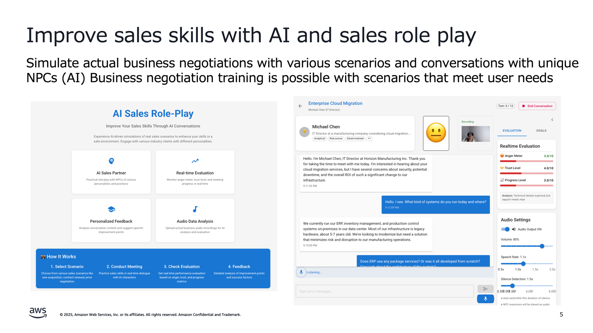
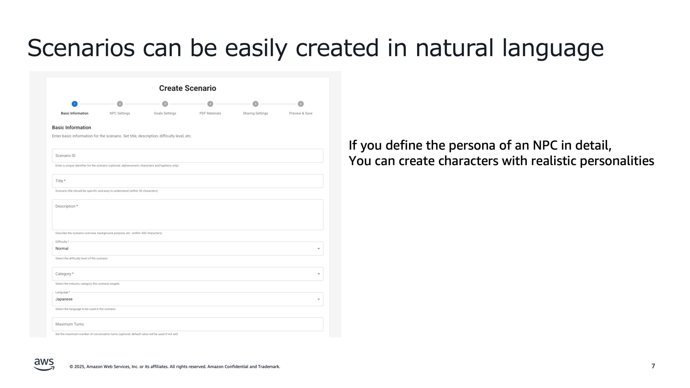
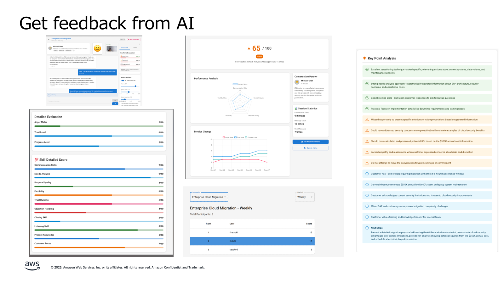
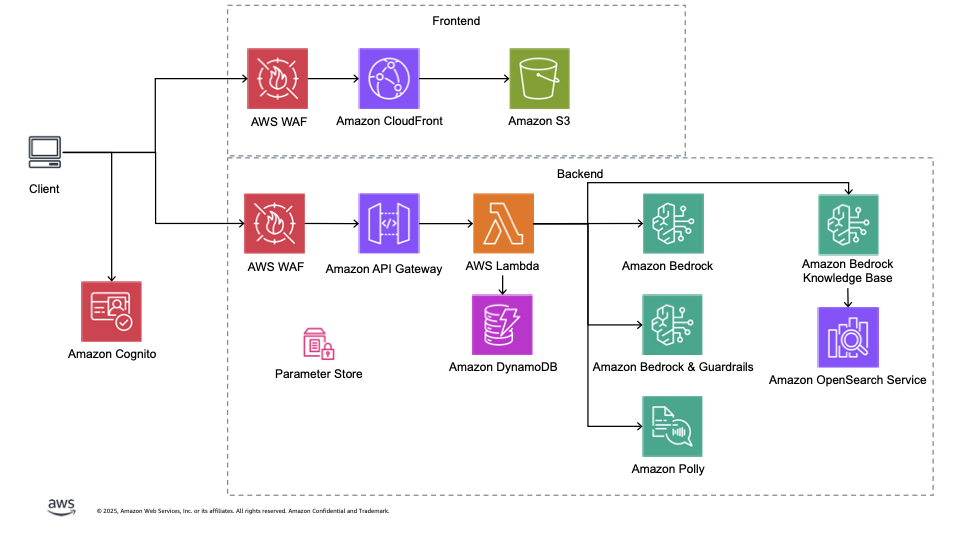

# AI Sales Roleplay

## Overview
A roleplay system for improving sales skills using generative AI. Users can develop practical sales skills through voice-based conversations with emotionally expressive AI.
This system is designed for junior sales representatives, helping them improve their sales skills through interactive simulations with AI.

### Key Features

- **Voice Conversation with AI**: Natural conversations powered by Amazon Bedrock
- **Real-time Emotional Feedback**: Visualization of anger meter, trust level, and progress
- **Diverse Scenarios**: Customizable sales scenes
- **Detailed Analysis Reports**: Improvement suggestions and feedback after each session
- **Video Analysis During Conversation**: Analyzes video during sessions to verify effective eye contact and gestures
- **Compliance Violation Check**: Identifies statements that violate compliance rules
- **Reference Check**: Verifies whether user statements are based on reference materials







### Technology Stack

**Frontend**
- React 19 + TypeScript
- Material UI 7
- Vite 6 (Build tool)
- AWS Amplify v6 (Authentication)
- React Context API (State management)

**Backend**
- AWS CDK (Infrastructure as Code)
- AWS Lambda (Python 3.13) + API Gateway
- Amazon Bedrock (Claude 3.5 Haiku, Claude Sonnet 4.5)
- Amazon Polly (Text-to-speech)
- Amazon Bedrock Guardrails (Compliance check)
- DynamoDB + RDS PostgreSQL
- Amazon S3 (PDF materials, audio files)
- Amazon Cognito (Authentication)

### Architecture


## Setup

### Prerequisites

- Docker
- Node.js 22.x or higher
- Python 3.12 or higher
- Latest AWS CLI
- Latest AWS CDK

### Deployment

#### Quick Deployment with AWS CloudShell

You can easily deploy without any prerequisites using AWS CloudShell:

1. **Log in to AWS Console** and click the CloudShell icon (terminal mark) at the top of the screen

2. **Run the following commands**
```bash
# Clone the repository
git clone https://github.com/aws-samples/sample-ai-sales-roleplay.git
cd sample-ai-sales-roleplay

# Run deployment script
chmod +x bin.sh
./bin.sh
```

3. **Deployment Options** (optional)
```bash
# Disable self-registration feature
./bin.sh --disable-self-register

# Use a different region
export AWS_DEFAULT_REGION=ap-northeast-1
./bin.sh

# Specify individual models
./bin.sh --conversation-model "us.anthropic.claude-3-5-sonnet-20241022-v2:0"

# Detailed customization
./bin.sh --cdk-json-override '{"context":{"default":{"allowedSignUpEmailDomains":["example.com"]}}}'
```

4. **After deployment completes, you can access the application from the displayed URL**

#### Manual Installation

1. **Clone the repository**
```bash
git clone https://github.com/aws-samples/sample-ai-sales-roleplay.git
cd sample-ai-sales-roleplay
```

2. **Install dependencies**
```bash
# Frontend
cd frontend
npm install

# Backend
cd ../cdk
npm install
```

3. **Environment Setup**
Refer to [AI Sales Roleplay Environment Setup](./cdk/README.md) (Japanese)

## Documentation

### Deployment & Configuration
- [bin.sh Deployment Script Reference](docs/deployment/bin-sh-reference.md) (Japanese)

### Feature Specifications
- [Scenario Creation Guide](docs/scenario-creation.md) (Japanese)
- [Video Analysis Feature](docs/video-analysis.md) (Japanese)

### API & Technical Specifications
- [Polly Lexicon Guide](docs/custom-resources/polly-lexicon-guide.md) (Japanese)

### Operations & Cost
- [Cost Estimation](docs/cost/コスト試算.md) (Japanese)

*Note: Most documentation is currently in Japanese. English translations are planned for future updates.*

## Project Structure

```
├── frontend/                    # React application
│   ├── src/
│   │   ├── components/         # UI components
│   │   ├── pages/              # Application pages
│   │   ├── services/           # API services, authentication, etc.
│   │   ├── hooks/              # Custom React hooks
│   │   ├── types/              # TypeScript type definitions
│   │   ├── utils/              # Utility functions
│   │   ├── i18n/               # Internationalization settings
│   │   └── config/             # Configuration files
│   └── docs/                   # Frontend-specific documentation
├── cdk/                        # AWS CDK infrastructure code
│   ├── lib/
│   │   ├── constructs/         # Reusable CDK constructs
│   │   │   ├── api/            # API Gateway related
│   │   │   ├── storage/        # S3, DynamoDB related
│   │   │   └── compute/        # Lambda related
│   │   └── stacks/             # Deployable stacks
│   ├── lambda/                 # Lambda function implementations
│   │   ├── bedrock/            # Amazon Bedrock integration
│   │   ├── scoring/            # Scoring engine
│   │   ├── textToSpeech/       # Text-to-speech synthesis
│   │   ├── scenarios/          # Scenario management
│   │   ├── sessions/           # Session management
│   │   ├── guardrails/         # Guardrails management
│   │   ├── rankings/           # Ranking features
│   │   └── videos/             # Video processing
│   └── data/                   # Initial data (scenarios, Guardrails config)
├── docs/                       # Project documentation
│   ├── api/                    # API specifications
│   ├── cost/                   # Cost estimation
│   ├── custom-resources/       # Custom resource guides
│   └── features/               # Feature specifications
└── .kiro/                      # Kiro AI configuration files
```

## Security

See [CONTRIBUTING](CONTRIBUTING.md#security-issue-notifications) for more information.

## License

This library is licensed under the MIT-0 License. See the LICENSE file.
