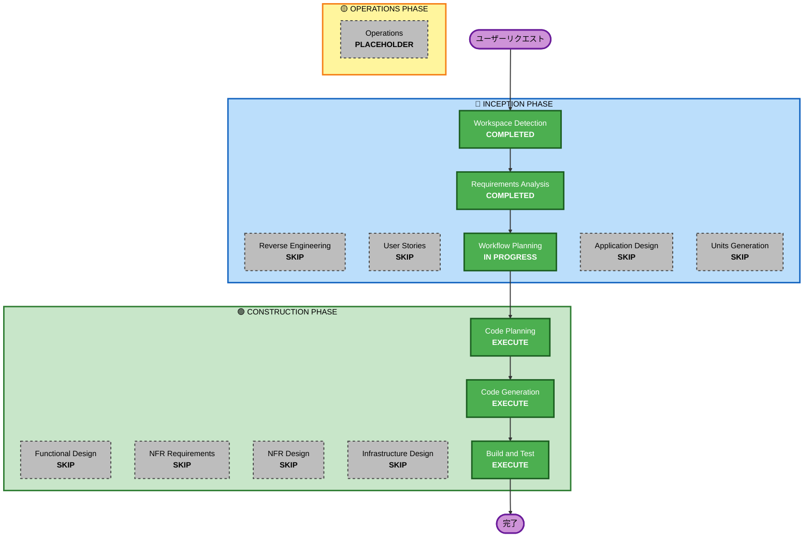

# 実行計画 - 会話画面UI/UXリデザイン

## 詳細分析サマリー

### 変更スコープ
- **変更タイプ**: 単一ページのUI/UXリデザイン（フロントエンドのみ）
- **主要変更**: ConversationPage.tsxのレイアウト全面刷新
- **関連コンポーネント**: 既存コンポーネントの再配置・削除・新規作成

### 変更影響評価
- **ユーザー向け変更**: Yes - 会話画面の見た目と操作性が大幅に変わる
- **構造変更**: Yes - レイアウト構造の全面変更（サイドバー→オーバーレイ）
- **データモデル変更**: No - バックエンドAPI・データ構造の変更なし
- **API変更**: No - 既存APIをそのまま使用
- **NFR影響**: 軽微 - パフォーマンス・アクセシビリティは既存NFRの範囲内

### コンポーネント関係

#### 削除対象
| コンポーネント | 変更タイプ | 理由 |
|---|---|---|
| EmojiFeedbackContainer | 削除 | アバター表情で代替 |
| EmojiFeedback | 削除（参照のみ） | EmojiFeedbackContainerから使用 |
| SidebarPanel | 削除 | オーバーレイパネルに置き換え |
| NPCInfoCard | 削除 | ペルソナパネルに置き換え |

#### 再利用・再配置対象
| コンポーネント | 変更タイプ | 理由 |
|---|---|---|
| VRMAvatarContainer | 再配置（中央大表示） | アバターステージとして中央に配置 |
| VideoManager | 再配置（隅に小さく） | アバターステージの隅に配置 |
| MetricsPanel | 再利用・改修 | オーバーレイスタイルに変更 |
| GoalsPanel | 再利用・改修 | オーバーレイスタイルに変更 |
| MessageList | 再利用・改修 | コンパクト化（max-height: 150px + 展開機能） |
| MessageInput | そのまま | 変更なし |
| ConversationHeader | 改修 | ボタン群の再構成 |
| ComplianceAlert | 改修 | ヘッダー下スライドインに変更 |

#### 新規作成対象
| コンポーネント | 用途 |
|---|---|
| MetricsOverlay | 左上メトリクスオーバーレイ |
| RightPanelContainer | 右側パネルコンテナ（ゴール+シナリオ+ペルソナ） |
| ScenarioPanel | シナリオ説明パネル |
| PersonaPanel | NPCペルソナパネル |
| CoachingHintBar | コーチングヒントバー |
| AvatarStage | アバター中央表示ステージ |

### リスク評価
- **リスクレベル**: Low
- **ロールバック複雑度**: Easy（フロントエンドのみ、git revertで復元可能）
- **テスト複雑度**: Moderate（UIレイアウト変更のため視覚的確認が必要）

## ワークフロー可視化

## 実行ステージ

### 🔵 INCEPTION PHASE
- [x] Workspace Detection (COMPLETED)
- [ ] Reverse Engineering - SKIP（既存成果物あり）
- [x] Requirements Analysis (COMPLETED)
- [ ] User Stories - SKIP
  - **理由**: UI/UXリデザインは既存ユーザー向け改善。ペルソナ・ストーリーは既知。
- [x] Workflow Planning (IN PROGRESS)
- [ ] Application Design - SKIP
  - **理由**: 既存コンポーネントの再配置・改修が中心。新規コンポーネントはシンプルなUIパーツのみで、設計ドキュメントは不要。モックv2で設計は検証済み。
- [ ] Units Generation - SKIP
  - **理由**: 単一ユニット（会話画面のみ）。分割不要。

### 🟢 CONSTRUCTION PHASE
- [ ] Functional Design - SKIP
  - **理由**: ビジネスロジックの変更なし。UIレイアウトの変更のみ。
- [ ] NFR Requirements - SKIP
  - **理由**: 既存NFR（パフォーマンス、アクセシビリティ）の範囲内。要件定義書のNFR-1〜NFR-5で十分。
- [ ] NFR Design - SKIP
  - **理由**: NFR Requirementsをスキップするため。
- [ ] Infrastructure Design - SKIP
  - **理由**: フロントエンドのみの変更。インフラ変更なし。
- [ ] Code Planning - EXECUTE（必須）
  - **理由**: 実装ステップの詳細計画が必要
- [ ] Code Generation - EXECUTE（必須）
  - **理由**: コード実装が必要
- [ ] Build and Test - EXECUTE（必須）
  - **理由**: リント・型チェック・テスト手順の確認が必要

### 🟡 OPERATIONS PHASE
- [ ] Operations - PLACEHOLDER

## 推定タイムライン
- **実行ステージ数**: 3（Code Planning + Code Generation + Build and Test）
- **推定所要時間**: 2-3時間

## 成功基準
- **主要目標**: モックv2のデザインをReact/Material UIで忠実に実装する
- **主要成果物**: 
  - ConversationPage.tsxの全面改修
  - 新規オーバーレイコンポーネント群
  - 既存コンポーネントの削除・改修
  - i18nキーの追加
- **品質ゲート**:
  - リントエラー0件
  - 型エラー0件
  - アクセシビリティ要件（NFR-2）の充足
  - 国際化対応（NFR-4）の充足
