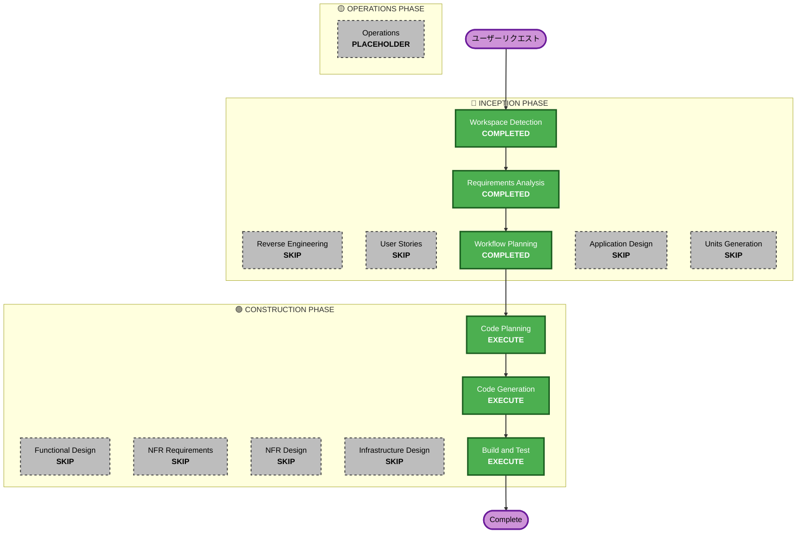

# 実行計画書 - VRMアップロード + Polly音声モデル選択

## 詳細分析サマリー

### 変更スコープ
- **変更タイプ**: 機能強化（既存インフラ拡張 + 新規UI + データモデル変更 + 技術的負債解消）
- **主要変更**: VRMアップロードUI追加、Polly音声モデル選択UI追加、エンジン自動選択、未使用コード削除
- **影響コンポーネント**: フロントエンド（シナリオ作成/編集画面、会話画面、サービス層）+ バックエンド（Lambda、CDKインフラ）

### 変更影響評価
- **ユーザー向け変更**: あり - シナリオ作成/編集画面にVRMアップロード・音声選択UI追加、会話画面で選択音声使用
- **構造変更**: なし - 既存アーキテクチャ内の拡張
- **データモデル変更**: あり - NPCInfoにvoiceIdフィールド追加
- **API変更**: あり - 既存アバターAPI活用、textToSpeech Lambdaにエンジン自動選択追加、不要API削除
- **NFR影響**: なし - 既存NFR範囲内（CloudFrontキャッシュ、S3署名付きURL等）

### リスク評価
- **リスクレベル**: Low
- **ロールバック複雑度**: Easy（フロントエンド変更中心、バックエンド変更は限定的）
- **テスト複雑度**: Moderate（UI統合テスト + API連携テスト）

## ワークフロー可視化



### テキスト代替
```
Phase 1: INCEPTION
  - Workspace Detection (COMPLETED)
  - Reverse Engineering (SKIP - 既存成果物あり)
  - Requirements Analysis (COMPLETED - 承認済み)
  - User Stories (SKIP - プロジェクト単純さに基づき)
  - Workflow Planning (COMPLETED)
  - Application Design (SKIP)
  - Units Generation (SKIP)

Phase 2: CONSTRUCTION
  - Functional Design (SKIP)
  - NFR Requirements (SKIP)
  - NFR Design (SKIP)
  - Infrastructure Design (SKIP)
  - Code Planning (EXECUTE)
  - Code Generation (EXECUTE)
  - Build and Test (EXECUTE)

Phase 3: OPERATIONS
  - Operations (PLACEHOLDER)
```

## 実行ステージ

### 🔵 INCEPTION PHASE
- [x] Workspace Detection (COMPLETED)
- [x] Reverse Engineering - SKIP（既存成果物あり）
- [x] Requirements Analysis (COMPLETED - 承認済み)
- [x] User Stories - SKIP（プロジェクト単純さに基づき）
- [x] Workflow Planning (COMPLETED)
- [x] Application Design - SKIP
  - **理由**: 既存コンポーネント（シナリオ作成/編集画面、AvatarService、PollyService）の拡張のみ。新規コンポーネント設計不要。
- [x] Units Generation - SKIP
  - **理由**: 単一ユニット（VRMアップロード + 音声選択は密結合）。分割不要。

### 🟢 CONSTRUCTION PHASE
- [x] Functional Design - SKIP
  - **理由**: 要件定義書に十分なデータモデル・ビジネスロジック記載済み。CRUD操作とドロップダウン選択のみ。
- [x] NFR Requirements - SKIP
  - **理由**: 既存NFR（CloudFrontキャッシュ、S3署名付きURL、50MBファイルサイズ制限）で十分。新規NFR不要。
- [x] NFR Design - SKIP
  - **理由**: NFR Requirementsスキップのため。
- [x] Infrastructure Design - SKIP
  - **理由**: 既存CDKパターン（S3、DynamoDB、Lambda、API Gateway、CloudFront）を踏襲。新規インフラパターン不要。
- [ ] Code Planning - EXECUTE
  - **理由**: 実装ステップの計画が必要。バックエンド + フロントエンド + 削除対象の整理。
- [ ] Code Generation - EXECUTE
  - **理由**: コード実装が必要。
- [ ] Build and Test - EXECUTE
  - **理由**: ビルド・テスト・検証が必要。

### 🟡 OPERATIONS PHASE
- [ ] Operations - PLACEHOLDER

## 推定タイムライン
- **実行ステージ数**: 3（Code Planning + Code Generation + Build and Test）
- **推定所要時間**: 2-3時間

## 成功基準
- **主要目標**: シナリオNPC設定でVRMアップロードと音声モデル選択が可能になること
- **主要成果物**:
  - VRMアップロードUI（シナリオ作成/編集画面）
  - Polly音声モデル選択ドロップダウン（シナリオ作成/編集画面）
  - エンジン自動選択ロジック（textToSpeech Lambda）
  - CloudFrontアバターS3オリジン追加
  - manifest.json・ハードコード音声マッピング・未使用API削除
- **品質ゲート**:
  - リントエラー0件
  - 型エラー0件
  - 既存機能への影響なし
