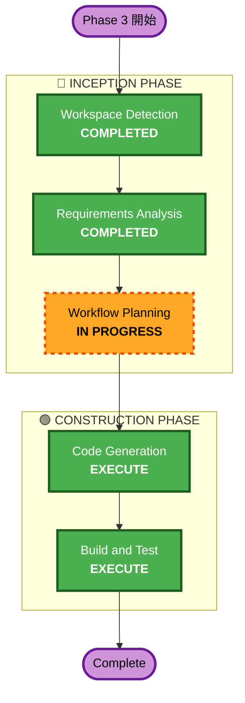

# Phase 3（拡張実装）実行計画

## 詳細分析サマリー

### 変更影響評価
- **ユーザー向け変更**: あり（ジェスチャーアニメーション、アイドルモーション、VRMアップロードUI、レスポンシブ対応）
- **構造変更**: あり（アバター管理Lambda新規、DynamoDBテーブル新規、S3バケット拡張）
- **データモデル変更**: あり（アバターメタデータテーブル新規）
- **API変更**: あり（アバターCRUD API新規4エンドポイント、realtime-scoringにgestureフィールド追加）
- **NFR影響**: あり（VRMファイルサイズ制限、CloudFrontキャッシュ、レスポンシブパフォーマンス）

### リスク評価
- **リスクレベル**: 中
- **ロールバック複雑度**: 中（インフラ変更あり、ただしCDKで管理）
- **テスト複雑度**: 中（フロントエンドアニメーション + バックエンドAPI）

## ワークフロー可視化

## 実行ステージ

### 🔵 INCEPTION PHASE
- [x] Workspace Detection - COMPLETED
- [x] Reverse Engineering - SKIP（既存成果物あり）
- [x] Requirements Analysis - COMPLETED
- [x] User Stories - SKIP
  - **理由**: Phase 1/2と同じユーザーペルソナ、技術拡張が主目的
- [x] Workflow Planning - IN PROGRESS
- [ ] Application Design - SKIP
  - **理由**: Phase 1で設計済みのコンポーネント構造を拡張するのみ。AnimationController、ExpressionControllerへのメソッド追加が主で、新規コンポーネント設計は不要（AvatarUpload/AvatarManagementは既存パターンに従う）
- [ ] Units Generation - SKIP
  - **理由**: 単一ユニットとして実装可能。機能間の依存関係が明確で分割不要

### 🟢 CONSTRUCTION PHASE
- [ ] Functional Design - SKIP
  - **理由**: ビジネスロジックは単純（CRUD操作、プロシージャルアニメーション）。複雑なドメインモデルなし
- [ ] NFR Requirements - SKIP
  - **理由**: Phase 3のNFR要件は要件定義書に十分記載済み。新たな技術スタック選定不要
- [ ] NFR Design - SKIP
  - **理由**: NFR Requirementsをスキップするため
- [ ] Infrastructure Design - SKIP
  - **理由**: 既存のCDKパターン（S3バケット、DynamoDBテーブル、Lambda、API Gateway）を踏襲。新しいインフラパターンなし
- [ ] Code Generation - EXECUTE
  - **理由**: 実装が必要。バックエンド（Lambda、CDK）+ フロントエンド（アニメーション拡張、アップロードUI）
- [ ] Build and Test - EXECUTE
  - **理由**: リント、型チェック、テスト手順の確認が必要

## 推定タイムライン
- **実行ステージ数**: 2（Code Generation + Build and Test）
- **推定期間**: 2-3時間

## 成功基準
1. うなずき・首かしげジェスチャーがAI応答に連動して自然に発生する
2. アイドルモーション（視線移動、体の揺れ）が待機中に動作する
3. 感情トランジションがスムーズに高度化される
4. VRMファイルのアップロード・管理がAPI経由で動作する
5. レスポンシブ対応でタブレット・モバイルでも表示される
6. 既存機能が正常に動作する
