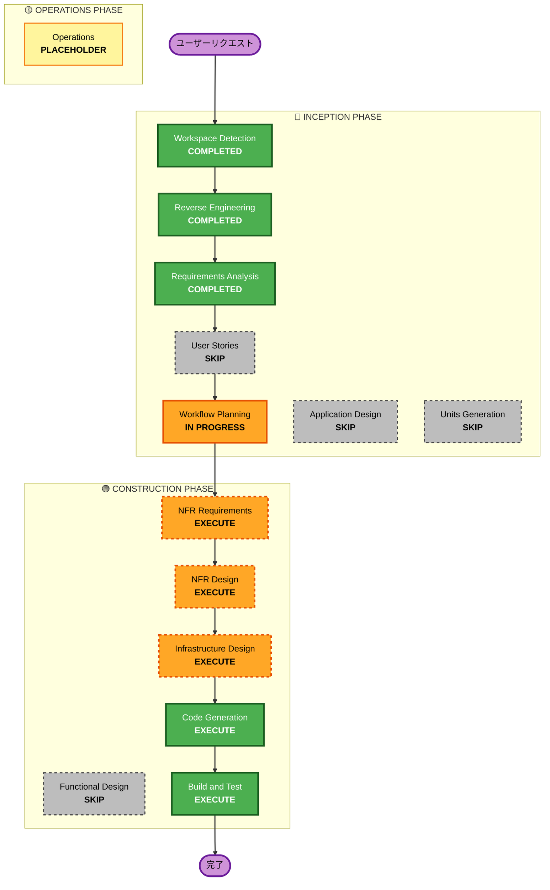

# 実行計画書: Strands Agent → Bedrock AgentCore Runtime 移行

## 詳細分析サマリー

### 変換スコープ（Brownfield）
- **変換タイプ**: インフラストラクチャ変換（Lambda → AgentCore Runtime）
- **主要変更**: 
  - Strands AgentのホスティングをLambdaからAgentCore Runtimeに移行
  - API認証をAPI Gateway + CognitoからAgentCore Identity Inbound Authに変更
- **関連コンポーネント**: 
  - CDK Infrastructure Stack
  - Lambda関数（bedrock, scoring, audioAnalysis）
  - API Gateway
  - フロントエンドAPIクライアント

### 変更影響評価
| 影響領域 | 影響 | 詳細 |
|---------|------|------|
| ユーザー向け変更 | ❌ なし | ユーザー体験への影響なし |
| 構造変更 | ✅ あり | Lambda → AgentCore Runtime |
| データモデル変更 | ❌ なし | 既存データモデル維持 |
| API変更 | ✅ あり | エンドポイントURL変更、認証ヘッダー形式変更 |
| NFR影響 | ✅ あり | Memory/Observability追加、コスト最適化 |

### コンポーネント関係図
```
InfrastructureStack
├── AuthConstruct (既存Cognito) ─────────────────┐
│   └── User Pool, App Client                    │ JWT認証連携
├── ApiConstruct (既存API Gateway)               │
│   └── /bedrock/*, /scoring/* [削除対象]        │
├── AgentCoreRuntimeConstruct (新規) ◄───────────┘
│   ├── NPC会話エージェント
│   ├── スコアリングエージェント
│   └── 音声分析エージェント
└── その他Constructs (変更なし)
```

### リスク評価
- **リスクレベル**: 中（Medium）
- **ロールバック複雑度**: 中程度（旧Lambda/API Gateway削除前であれば容易）
- **テスト複雑度**: 中程度（エンドツーエンドテスト必要）

---

## ワークフロー可視化



---

## 実行フェーズ詳細

### 🔵 INCEPTION PHASE
- [x] Workspace Detection - COMPLETED
- [x] Reverse Engineering - COMPLETED
- [x] Requirements Analysis - COMPLETED
- [x] User Stories - **SKIP**
  - **理由**: 技術移行であり、ユーザー向け機能変更なし
- [x] Workflow Planning - IN PROGRESS
- [ ] Application Design - **SKIP**
  - **理由**: 新規コンポーネント設計不要、既存ロジックの移植のみ
- [ ] Units Generation - **SKIP**
  - **理由**: 単一の移行作業であり、複数ユニットへの分割不要

### 🟢 CONSTRUCTION PHASE
- [ ] Functional Design - **SKIP**
  - **理由**: ビジネスロジック変更なし、既存ロジック維持
- [ ] NFR Requirements - **EXECUTE**
  - **理由**: AgentCore Memory/Observability活用、コスト最適化要件あり
- [ ] NFR Design - **EXECUTE**
  - **理由**: NFR要件に基づく設計パターン定義が必要
- [ ] Infrastructure Design - **EXECUTE**
  - **理由**: AgentCore Runtime CDK実装、Custom Resource設計が必要
- [ ] Code Generation - **EXECUTE** (ALWAYS)
  - **理由**: CDKコンストラクト、エージェントコード、フロントエンド変更の実装
- [ ] Build and Test - **EXECUTE** (ALWAYS)
  - **理由**: ビルド、テスト、検証が必要

### 🟡 OPERATIONS PHASE
- [ ] Operations - PLACEHOLDER
  - **理由**: 将来のデプロイ・監視ワークフロー用

---

## 実装ユニット

本移行は単一ユニットとして実装：

### Unit: AgentCore Runtime Migration
| 項目 | 内容 |
|-----|------|
| **スコープ** | Lambda → AgentCore Runtime移行全体 |
| **CDK変更** | AgentCoreRuntimeConstruct新規作成、API Gateway一部削除 |
| **Lambda変更** | bedrock, scoring, audioAnalysis → AgentCore形式に変換 |
| **フロントエンド変更** | APIクライアントのエンドポイント・認証ヘッダー変更 |

---

## 成功基準

### 主要目標
- Strands AgentがAgentCore Runtime上で正常動作
- Cognito JWT認証によるInbound Auth動作
- 既存機能の完全な互換性維持

### 主要成果物
1. `cdk/lib/constructs/agentcore/agentcore-runtime.ts` - AgentCore Runtime Construct
2. `cdk/lambda/agentcore-custom-resource/` - Custom Resource Lambda
3. `cdk/lambda/agentcore/npc/` - NPC会話エージェント（AgentCore形式）
4. `cdk/lambda/agentcore/scoring/` - スコアリングエージェント（AgentCore形式）
5. `cdk/lambda/agentcore/audio/` - 音声分析エージェント（AgentCore形式）
6. `frontend/src/services/AgentCoreService.ts` - AgentCore呼び出しサービス

### 品質ゲート
- [ ] CDK synth成功
- [ ] CDK nag セキュリティチェック通過
- [ ] AgentCore Runtime作成成功
- [ ] Inbound Auth JWT認証動作確認
- [ ] 既存機能の動作確認（NPC会話、スコアリング、音声分析）
- [ ] フロントエンドからの呼び出し成功

---

## 推定タイムライン

| フェーズ | ステージ | 推定時間 |
|---------|---------|---------|
| CONSTRUCTION | NFR Requirements | 30分 |
| CONSTRUCTION | NFR Design | 30分 |
| CONSTRUCTION | Infrastructure Design | 1時間 |
| CONSTRUCTION | Code Generation | 2-3時間 |
| CONSTRUCTION | Build and Test | 1時間 |
| **合計** | | **5-6時間** |

---

**作成日**: 2026-01-08
**バージョン**: 1.0
