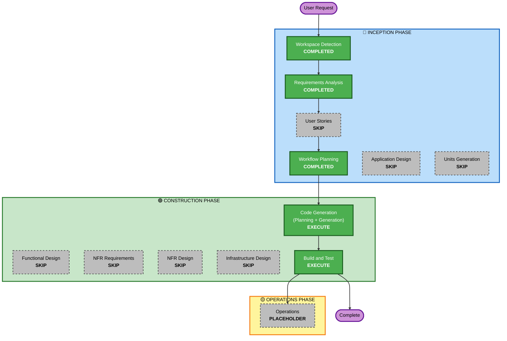

# 実行計画書 - AWS Summit デモ展示向け機能強化（サジェスト返答ボタン）

## 詳細分析サマリー

### 変換スコープ（Brownfield）
- **変換タイプ**: 単一機能の追加（Single component change）
- **主な変更**: サジェスト返答ボタン（AI動的生成）の追加
- **関連コンポーネント**: 会話画面（ConversationPage + 新規 SuggestionBar）、リアルタイムスコアリングエージェント、シナリオ管理Lambda、型定義、i18n

### 変更影響評価
- **ユーザー向け変更**: Yes — 会話画面に返答候補ボタンが追加される（既存フローへの加算、破壊的変更なし）
- **構造的変更**: No — 既存アーキテクチャ（AgentCore Runtime + React）の枠内
- **データモデル変更**: 軽微 — `ScoringResult` に `suggestions` 追加、シナリオに `suggestionEnabled` 追加（いずれも後方互換）
- **API変更**: 軽微 — リアルタイムスコアリングのレスポンスにフィールド追加（後方互換）
- **NFR影響**: 軽微 — 既存のスコアリング呼び出しに相乗りのため追加API呼び出しなし。トークン消費はフラグ制御で抑制

### コンポーネント関係
- **Primary Component**: `frontend/src/pages/ConversationPage.tsx`（+ 新規 `SuggestionBar`）
- **Shared Components**: `frontend/src/types/api.ts`, `frontend/src/types/index.ts`（型定義）
- **Dependent Components**: `AgentCoreService.ts`, `ApiService.ts`（レスポンス伝搬）
- **Backend Components**: `cdk/agents/realtime-scoring/`（models.py, prompts.py）, `cdk/lambda/scenarios/index.py`
- **Supporting Components**: `frontend/src/i18n/locales/{ja,en}.json`, `cdk/data/scenarios.json`

### リスク評価
- **リスクレベル**: Low
- **ロールバック複雑度**: Easy（フラグ無効化で機能停止可能、後方互換）
- **テスト複雑度**: Simple

## ワークフロー可視化

## 実行ステージ

### 🔵 INCEPTION PHASE
- [x] Workspace Detection (COMPLETED)
- [x] Reverse Engineering (SKIPPED - 既存成果物あり)
- [x] Requirements Analysis (COMPLETED)
- [x] User Stories (SKIPPED)
  - **理由**: サジェスト返答ボタンという単一の汎用機能追加。既存ユーザータイプの範囲内で新規ペルソナなし。要件定義書で機能要件・受け入れ観点が明確
- [x] Workflow Planning (COMPLETED)
- [ ] Application Design - **SKIP**
  - **理由**: 新規サービス層は不要。新規コンポーネントは SuggestionBar 1つのみで、既存の ConversationPage への組み込みパターン（CoachingHintBar 等）が確立済み。設計ドキュメント化の価値が低い
- [ ] Units Generation - **SKIP**
  - **理由**: 単一ユニット。分解不要

### 🟢 CONSTRUCTION PHASE
- [ ] Functional Design - **SKIP**
  - **理由**: 複雑なビジネスロジックや新規データモデルなし。候補生成はプロンプト追記、UIは既存パターン踏襲
- [ ] NFR Requirements - **SKIP**
  - **理由**: 既存NFR設定で十分。要件定義書のNFRセクションに記載済み（レイテンシ・コスト・後方互換）
- [ ] NFR Design - **SKIP**
  - **理由**: NFR Requirements をスキップ。新規NFRパターンの導入なし
- [ ] Infrastructure Design - **SKIP**
  - **理由**: インフラ変更なし。既存の AgentCore Runtime・Lambda・DynamoDB をそのまま使用
- [ ] Code Generation - **EXECUTE**（ALWAYS）
  - **理由**: 実装計画とコード生成が必要
- [ ] Build and Test - **EXECUTE**（ALWAYS）
  - **理由**: ビルド・型チェック・リント・テストが必要

### 🟡 OPERATIONS PHASE
- [ ] Operations - PLACEHOLDER

## 推定タイムライン
- **実行ステージ数**: 2（Code Generation, Build and Test）
- **スキップステージ数**: 7
- **推定期間**: 2〜4時間（実装規模が小さいため。準備期間2週間に対し十分な余裕）

## 成功基準
- **主目標**: シナリオ設定でON/OFFできる汎用機能として、AI動的生成のサジェスト返答ボタンを会話画面に追加する
- **主要成果物**:
  - リアルタイムスコアリングの `suggestions` 出力
  - 会話画面のサジェストボタンUI（`SuggestionBar`）と送信連携
  - シナリオ設定 `suggestionEnabled` フラグ（フロント型 + Lambda + 初期データ）
  - i18n キー（ja/en）
- **品質ゲート**:
  - TypeScript型エラーなし（`any` 不使用）
  - フロントエンドリントエラーなし
  - 後方互換（`suggestions`/`suggestionEnabled` 未設定でも既存フロー動作）
  - アクセシビリティ（aria-label、キーボード操作）
  - i18n ja/en 整合
